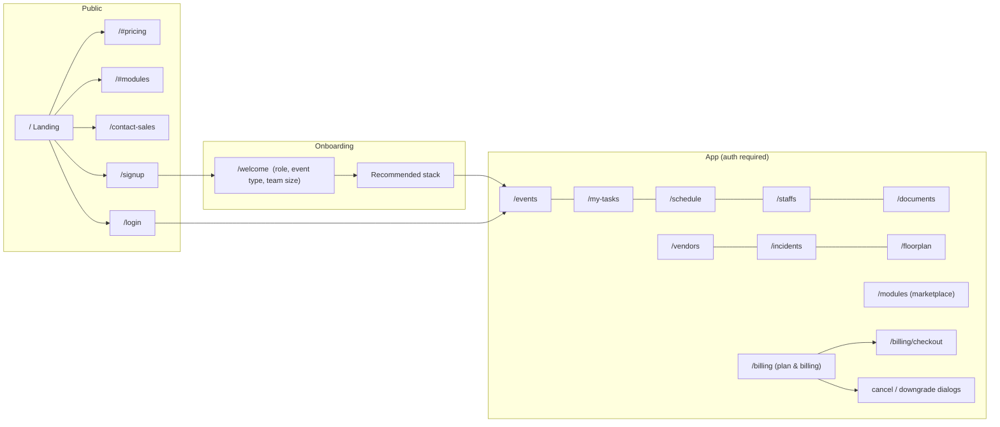
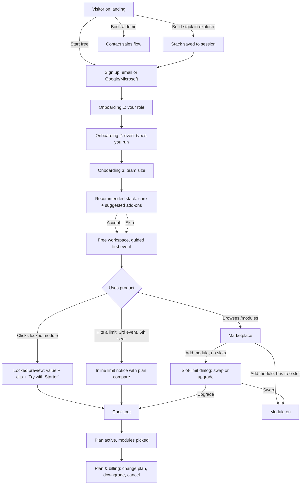

# EventHQ: Information Architecture & User Flows

Status: Stage 3 deliverable. Diagrams are Mermaid (they render on GitHub).

## 1. Sitemap

**Navigation model in the app.** The sidebar lists the modules that are switched on, then a hairline divider, then the locked modules from the catalog that are recommended for this workspace (max 3, shown with a lock). After that come **Browse modules** and **Plan & billing**. Locked items are never hidden and never dead ends. They open a preview.

## 2. Free → paid core flow

## 3. Flow specs

### 3.1 Sign up (`/signup`)
- **Step 1:** Continue with Google · Continue with Microsoft · or work email. One field and one button.
- **Step 2 (email path only):** full name and password, with a show/hide toggle. Strength hint sits below the field.
- Staff accounts are not self-serve. "Joining a team? Ask your organizer for an invite, or **Log in**."
- A stack picked in the module explorer (sessionStorage) is carried through and shown as a "Your stack: 4 modules" chip.
- Errors show inline under each field. The submit button stays enabled and focus moves to the first invalid field.

### 3.2 Onboarding (`/welcome`)
3 single-question steps (big radio tiles plus an explicit Continue, so keyboard users moving through radios aren't advanced by accident), with a hairline progress rule at the top. Skip is always visible.
1. *What best describes you?* Agency · In-house events team · Venue · Festival / production company · Freelance planner
2. *What do you run?* (multi) Conferences · Festivals · Corporate events · Weddings · Webinars
3. *How big is your team?* Just me · 2-10 · 11-50 · 51+
→ **Recommended stack:** the core modules (included) plus up to 5 suggested live add-ons, ranked by event-type affinity, with the explorer stack merged in. Roadmap picks become a notify list ("Still in development: … We'll email you"). If add-ons are selected, the primary action is **Start free trial with N modules** (no card) and the secondary is **Continue on Free** (picks are kept but locked). With none selected, the only action is **Go to my workspace**. Payment is never asked for here.

### 3.3 First-run
- Events page empty state: a hairline illustration of an empty run-of-show, the line "Your first event takes about 2 minutes", **Create event**, and a sample event ("Load a sample festival") so the user can explore with realistic data.
- Setup checklist card (dismissible): Create an event · Invite a teammate · Add a schedule item · Try the assistant (Ctrl+K). Progress shows as a hairline meter with no filled track.

### 3.4 Marketplace (`/modules`)
- Search (with "/" shortcut), category rail, and an "Recommended for festivals" row that uses the onboarding answers.
- Card: name, one-line outcome, category, status (**On**, **Add**, **Included**, **Coming soon**).
- A slot meter in the header: "3 of 5 add-on slots used · Starter".
- Roadmap modules: **Notify me** (honest about what's not built).

### 3.5 Locked module state
A route to a locked module renders a **preview** instead of the module:
- Module name and a one-sentence outcome
- Product clip (where one exists) or hairline diagram
- 3 concrete "what you can do" bullets
- Which plans include it, and the user's current slot status
- Primary: **Add to my plan**. This goes to checkout, or turns the module on directly if a slot is free.
- Secondary: **Back to events**
- Never a 403, never a blank page.

### 3.6 Upgrade triggers (contextual, rate-limited)
| Trigger | Surface | Frequency cap |
|---|---|---|
| Opens a locked module | Full preview (3.5) | Always (user-initiated) |
| Creates 3rd active event on Free | Inline notice in the create dialog | Each time (it's a hard limit) |
| Invites 6th seat | Inline in the invite form | Each time |
| Adds module with no free slot | Swap-or-upgrade dialog | Each time |
| Assistant hits monthly limit | Inline message in the assistant panel | Once per day |
| 3 events completed on Free | Dismissible banner "You're running events like a pro team" | Once, 30-day snooze |
Rules: never interrupt with a modal the user didn't trigger. Never block reading existing data. Always offer "Not now".

### 3.7 Module limit reached
Dialog: "You've used all 5 Starter slots."
- **Swap a module:** lists active add-ons with their last-used date ("Inventory, last used 41 days ago"). Picking one turns it off and turns the new one on. Data is kept, with a short note on that.
- **Upgrade to Growth:** 20 slots, a price-delta line ("+$100/mo, prorated today"), then checkout.
- Cancel.

### 3.8 Checkout (`/billing/checkout?plan=growth`)
Two columns, which stack on mobile:
- Left: billing cycle toggle, card fields (mock, Stripe Elements in production), billing email, company/VAT (optional, collapsed).
- Right: order summary (plan, cycle, modules picked, proration, total today, renewal date).
- Primary: **Confirm and pay $X**. Trust line: "Cancel any time from Plan & billing".
- Success state: confirmation, then "Pick your modules" if there are unused slots.

### 3.9 Plan management (`/billing`)
- Current plan card: plan name, cycle, renewal date, slot meter, seats and events usage.
- Your add-on modules list (swap or remove).
- Actions: Change plan · Switch to annual (shows savings) · Update payment · Invoices.
- **Downgrade:** shows what changes (slots 20 → 5). The user picks which 5 to keep, and the rest become read-only, not deleted. Takes effect at period end.
- **Cancel:** 2 steps. (1) One optional reason, a radio list. (2) Consequences in plain words, plus a save offer only if it fits ("Pause for 3 months" for seasonal users), then **Cancel subscription**. No dark patterns: the cancel button is as prominent as the keep button.

### 3.10 Enterprise contact (`/contact-sales`)
- Short form: work email, name, company, team size (select), event volume per year (select), "What do you need?" checkboxes (SSO, procurement/security review, migration, custom integrations), and an optional note.
- The right column shows what happens next (reply within 1 business day, a 30-min call, a tailored module plan) plus an Enterprise feature list.
- Success: a confirmation with "Meanwhile, start free; we'll upgrade your workspace in place".
- Pre-fill: if the user is logged in, email/name/company are pre-filled and the workspace is linked.

## 4. Entitlement model (implementation)
- `plan`: `free | starter | growth | enterprise`
- `slots`: free 0, starter 5, growth 20, enterprise all
- `addOns: string[]`: chosen module ids (≤ slots)
- A module is **available** if it's core, or in `addOns`, or plan = enterprise.
- Stored client-side for this prototype (`localStorage`). Production moves it to `/api/billing` and enforces it server-side, because the client is not a trust boundary.
